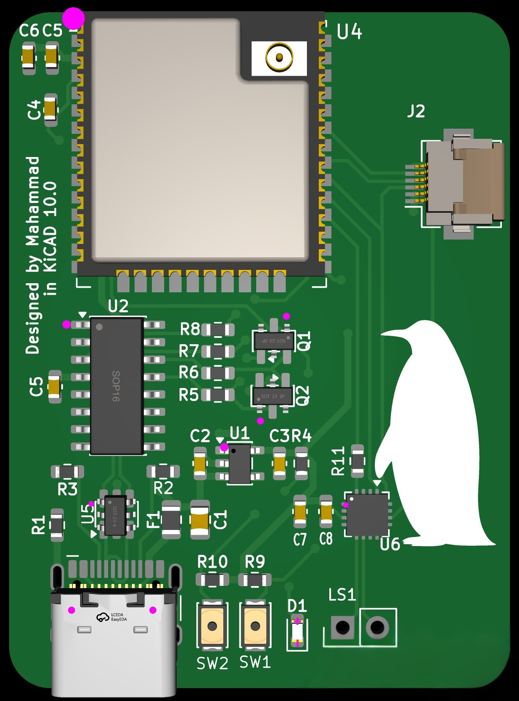
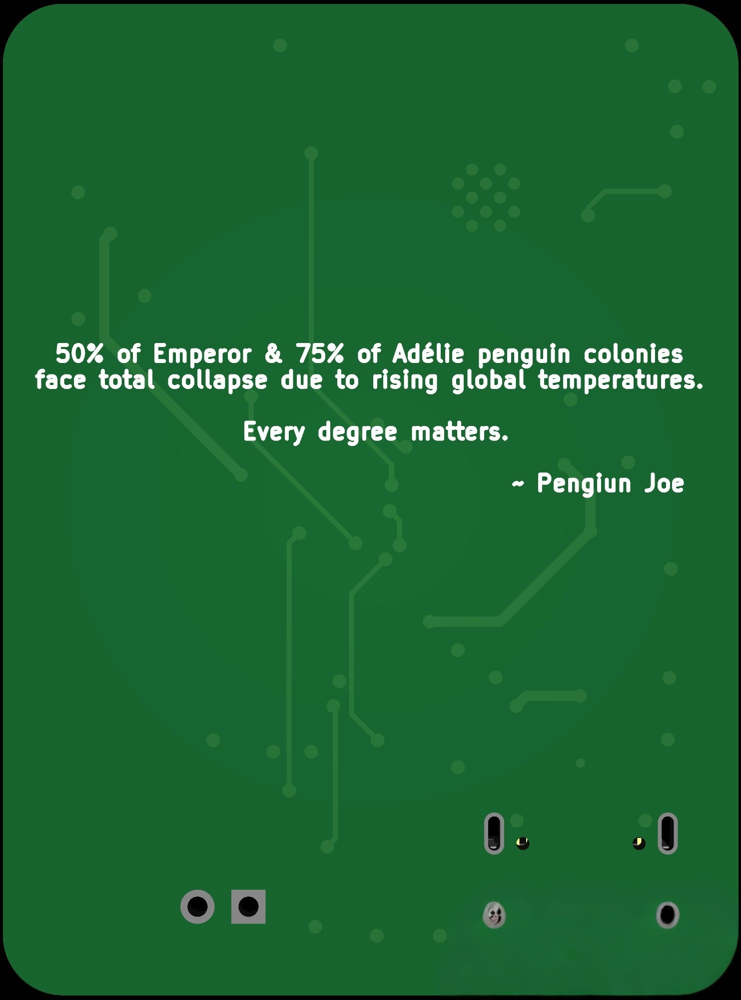
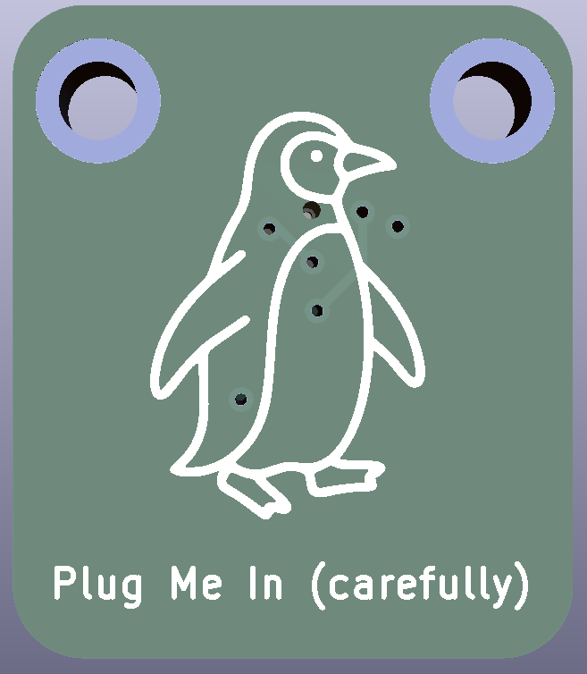

# Penguin-joe
## Esp32 based talk-back bot features external custom microphone module.
## Description 
### Motivation
It is good to have companion with you while coding, wathing or ext. And what if that companion is an Penguin joe?

## Hardware Design Decisions
Penguin Joe uses a two-board modular architecture:

Audio in → ESP32 → Cloud APIs → Audio out → Speaker.

This two modules connects to each other by 6-pin, 0.5 mm-pitch FFC/FPC connector and cable.
[For more Information](HardwareDesignDecisions.md)
### Schematics 
[Main](Processor.pdf)  

[Microphone](docs/ICS-43434_Microphone.pdf)

### Main Board

The main board contains the Esp32 processor, XC6220B331MR LDO ,MAX98357A amplifier.

() () 

### Microphone Board

Separated Microphone MODULE was designed for the placement in shell.

() () 

## Future Improvements

Will add functioning body parts and modules for that design. 
