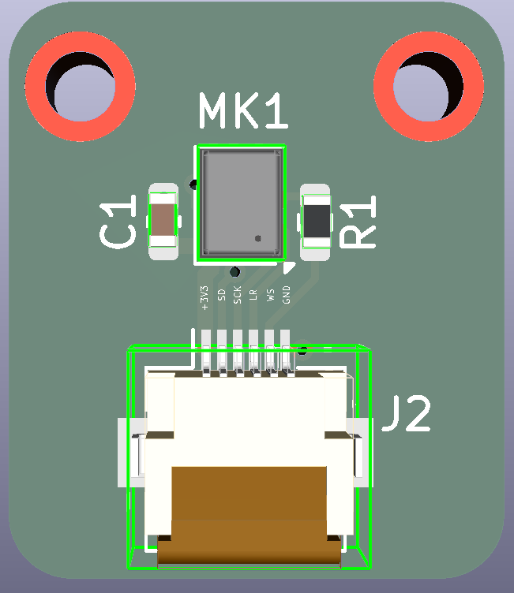

# Pengiun-joe
## Esp32 based talk-back bot features external custom microphone module.
## Description 
### Motivation
It is like to have companion with you while coding, wathing or ext. And what if that companion is an Pengiun joe?

## Hardware

Penguin Joe uses a two-board modular architecture:

### Schematics 
[Microphone](docs/ICS-43434 Microphone.pdf)
### Main Board

The main board contains the Esp32 processor, XC6220B331MR LDO ,MAX98357A amplifier.

Board uses 5V@2A for amplifier and 3.3v@1A for other components.

() () 

### Microphone Board

Separated Microphone MODULE was designed for the placement in shell.

() () 
